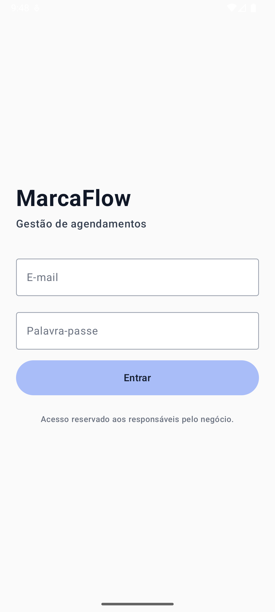
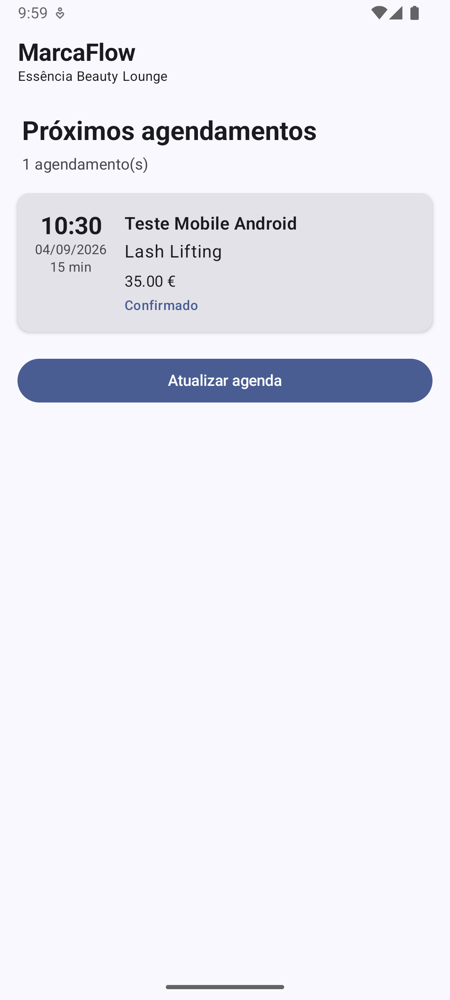

# MarcaFlow Android

Aplicação Android nativa do **MarcaFlow**, uma plataforma SaaS multiempresa para gestão de agendamentos.

O aplicativo foi desenvolvido em **Kotlin e Jetpack Compose** e integra-se ao backend real do MarcaFlow através de REST APIs autenticadas.

O objetivo da aplicação mobile é permitir que os responsáveis pelos negócios consultem e acompanhem a agenda diretamente através de dispositivos Android.


## Preview

<p align="center">
  
  
</p>

---

## Sobre o MarcaFlow

O MarcaFlow é um SaaS de gestão de agendamentos desenvolvido para:

- Salões de beleza
- Clínicas estéticas
- Barbearias
- Profissionais independentes
- Pequenos negócios baseados em marcações

A plataforma web permite que clientes realizem reservas online enquanto os responsáveis pelos negócios gerem serviços, horários, clientes, marcações e disponibilidade.

Este repositório contém exclusivamente a **aplicação Android nativa**.

Backend e plataforma web:

[MarcaFlow SaaS](https://github.com/afoliveira111/agenda-saas)

---

## Funcionalidades implementadas

### Autenticação

- Login com e-mail e palavra-passe
- Integração com endpoint real de autenticação
- Autenticação através de Bearer Token
- Tratamento de credenciais inválidas
- Tratamento de erros de rede
- Estados de loading, sucesso e erro

### Agenda

- Consulta dos próximos agendamentos
- Atualização manual da agenda
- Identificação automática do negócio associado ao utilizador
- Consulta de dados reais armazenados no PostgreSQL

Cada marcação apresenta:

- Cliente
- Serviço
- Data
- Horário
- Duração
- Preço
- Estado da marcação

---

## Tecnologias

- Kotlin
- Android SDK
- Jetpack Compose
- Material 3
- MVVM
- Coroutines
- StateFlow
- Retrofit
- Gson
- REST APIs
- Gradle Kotlin DSL
- Version Catalog

---

## Arquitetura

A aplicação utiliza separação entre apresentação, domínio e acesso a dados.

```text
presentation
    ↓
ViewModel
    ↓
StateFlow
    ↓
Repository
    ↓
Retrofit
    ↓
REST API
    ↓
MarcaFlow Backend
```

A comunicação completa funciona da seguinte forma:

```text
Android App
    ↓
Jetpack Compose
    ↓
ViewModel
    ↓
Coroutines / StateFlow
    ↓
Repository
    ↓
Retrofit
    ↓
REST API
    ↓
Next.js Backend
    ↓
Prisma ORM
    ↓
PostgreSQL
```

---

## Estrutura do projeto

```text
app/
└── src/
    └── main/
        ├── java/com/afoliveira/marcaflow/
        │
        │   ├── data/
        │   │   ├── remote/
        │   │   │   ├── dto/
        │   │   │   │   ├── AppointmentDto.kt
        │   │   │   │   ├── AppointmentsResponse.kt
        │   │   │   │   ├── LoginRequest.kt
        │   │   │   │   └── LoginResponse.kt
        │   │   │   │
        │   │   │   ├── MarcaFlowApi.kt
        │   │   │   └── RetrofitClient.kt
        │   │   │
        │   │   └── repository/
        │   │       └── MarcaFlowRepository.kt
        │   │
        │   ├── domain/
        │   │   └── model/
        │   │       └── Appointment.kt
        │   │
        │   ├── presentation/
        │   │   ├── agenda/
        │   │   │   ├── AgendaScreen.kt
        │   │   │   ├── AgendaUiState.kt
        │   │   │   └── AgendaViewModel.kt
        │   │   │
        │   │   └── login/
        │   │       ├── LoginScreen.kt
        │   │       ├── LoginUiState.kt
        │   │       └── LoginViewModel.kt
        │   │
        │   ├── ui/theme/
        │   └── MainActivity.kt
        │
        ├── res/
        └── AndroidManifest.xml
```

---

## API

A aplicação utiliza endpoints específicos disponibilizados pelo backend do MarcaFlow.

### Login

```http
POST /api/mobile/login
```

Request:

```json
{
  "email": "user@example.com",
  "password": "password"
}
```

Em caso de autenticação válida, a API retorna uma sessão mobile:

```json
{
  "token": "...",
  "expiresAt": "...",
  "user": {
    "id": "...",
    "name": "...",
    "email": "...",
    "role": "OWNER"
  },
  "business": {
    "id": "...",
    "name": "...",
    "slug": "..."
  }
}
```

---

### Agendamentos

```http
GET /api/mobile/appointments
```

O token recebido no login é enviado através do header:

```http
Authorization: Bearer <TOKEN>
```

O backend identifica o utilizador e retorna apenas as marcações pertencentes ao negócio associado à conta autenticada.

---

## Integração com o backend

A aplicação utiliza Retrofit para comunicação com:

```text
https://agenda-saas-zeta.vercel.app/
```

Fluxo de autenticação:

```text
E-mail + palavra-passe
        ↓
POST /api/mobile/login
        ↓
Backend valida utilizador
        ↓
Sessão criada
        ↓
Bearer Token
        ↓
Android utiliza o token
        ↓
GET /api/mobile/appointments
```

---

## Fluxo real de dados

O aplicativo utiliza dados reais da plataforma.

Exemplo:

```text
Cliente realiza uma marcação
        ↓
Página pública MarcaFlow
        ↓
Next.js
        ↓
Prisma
        ↓
PostgreSQL
        ↓
REST API
        ↓
Retrofit
        ↓
Android
        ↓
Agenda exibida com Jetpack Compose
```

---

## Segurança

Algumas medidas utilizadas na integração:

- Comunicação através de HTTPS
- Autenticação mobile através de Bearer Token
- Tokens de sessão gerados no backend
- Token armazenado no servidor apenas através do respetivo hash
- Sessões com data de expiração
- Endpoints mobile protegidos
- Dados filtrados pelo negócio associado ao utilizador
- Passwords nunca armazenadas no aplicativo
- Credenciais não versionadas no Git

---

## Estados de UI

A interface utiliza estados explícitos através de `StateFlow`.

Exemplo:

```kotlin
sealed interface AgendaUiState {

    data object Loading : AgendaUiState

    data class Success(
        val appointments: List<Appointment>
    ) : AgendaUiState

    data class Error(
        val message: String
    ) : AgendaUiState
}
```

Isso permite que a interface Compose reaja automaticamente às mudanças de estado da aplicação.

---

## Exemplo do fluxo MVVM

```text
AgendaScreen
     ↓
AgendaViewModel
     ↓
MarcaFlowRepository
     ↓
MarcaFlowApi
     ↓
Retrofit
     ↓
MarcaFlow Backend
```

---

## Como executar

Clone o repositório:

```bash
git clone https://github.com/afoliveira111/marcaflow-android.git
```

Entre na pasta:

```bash
cd marcaflow-android
```

Abra o projeto no Android Studio.

Ou compile através do Gradle:

```bash
./gradlew assembleDebug
```

---

## Requisitos

- Android Studio
- JDK compatível com o projeto
- Android SDK 36 para compilação
- Minimum SDK 26
- Ligação à internet para utilização da API

---

## Estado atual

Atualmente estão funcionais:

- Aplicação Android nativa
- Interface com Jetpack Compose
- Login real
- Autenticação via Bearer Token
- Integração Retrofit
- Comunicação com backend em produção
- Consulta de agendamentos reais
- Identificação do negócio autenticado
- Estados de loading, sucesso e erro
- Atualização da agenda

---

## Roadmap

Melhorias planeadas:

- Persistência segura da sessão
- Logout
- Navegação estruturada entre telas
- Detalhes completos da marcação
- Filtros por data
- Agenda diária e semanal
- Alteração do estado da marcação
- Reagendamento através do Android
- Gestão de clientes
- Notificações push
- Cache local
- Suporte offline
- Testes unitários para ViewModels e Repository
- Testes de UI com Compose

---

## Projeto relacionado

O backend, página pública e painel administrativo estão disponíveis no repositório:

### MarcaFlow SaaS

https://github.com/afoliveira111/agenda-saas

Tecnologias principais do backend:

- Next.js
- React
- TypeScript
- Prisma
- PostgreSQL
- Neon Database
- Vercel
- Brevo

---

## Objetivo técnico

Este projeto foi criado como extensão mobile de uma aplicação SaaS real, com o objetivo de aplicar conceitos de desenvolvimento Android em um cenário completo de produção.

Entre os conceitos utilizados estão:

- Kotlin
- Jetpack Compose
- MVVM
- StateFlow
- Coroutines
- Repository Pattern
- Retrofit
- REST APIs
- Autenticação
- Integração mobile/backend
- Tratamento de estados de UI
- Arquitetura em camadas

---

## Autor

Desenvolvido por **António Felipe Aguiar de Oliveira**.

GitHub: [afoliveira111](https://github.com/afoliveira111)

LinkedIn: [António Felipe](https://www.linkedin.com/in/id-antonio-felipe/)
